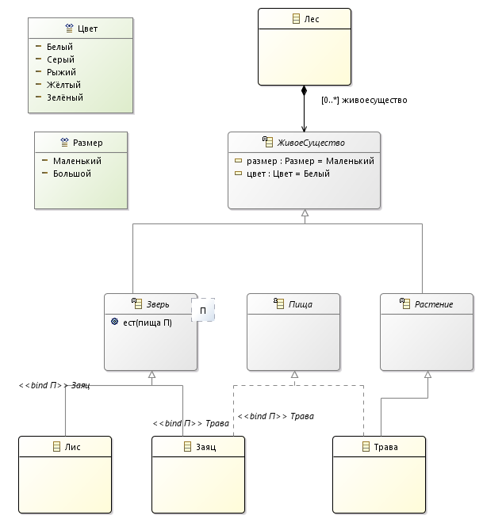
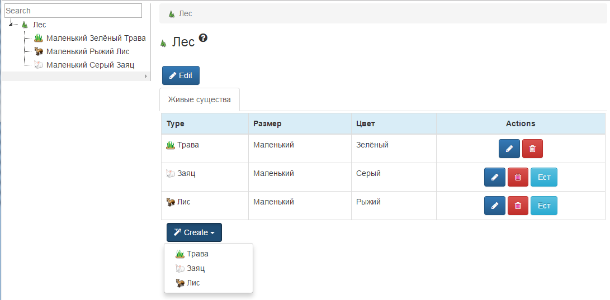

# Природа

Модель живых существ в лесу участвующих в пищевой цепочке и веб-приложение сгенерированное 
из модели.

## Ресурсы

* [Видео показывающее процесс создания модели и веб приложения](https://youtu.be/nYIscAuDoCI). 

## Диаграмма классов

## Веб интерфейс

