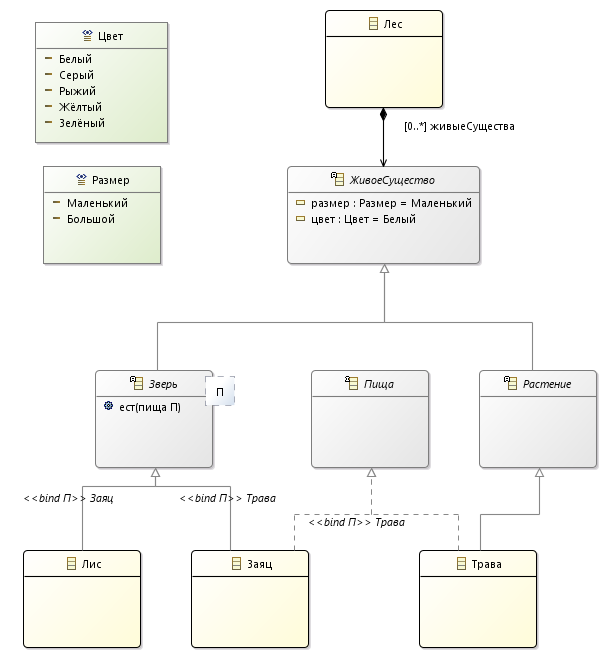

# Природа

Модель живых существ в лесу участвующих в пищевой цепочке и веб-приложение сгенерированное 
из модели.

## Ресурсы

* [Видео показывающее процесс создания модели и веб приложения](https://youtu.be/nYIscAuDoCI). 
* [Многопользовательские MDD Web Приложения](https://youtu.be/todo) (видео).
* Инсталляция
    * [Windows](http://www.nasdanika.org/products/nature/products/)
    * [Linux]((http://www.nasdanika.org/products/nature/products/)
    
## Запуск

* Сгрузите инсталляцию для своей операционной системы, 
* Распакуйте, 
* Запустите ``eclipse.exe`` для Windows или ``eclipse`` для Linux.
* Откройте http://localhost:8080/nature/index.html в Web браузере.      

## Версия 1.0.0 - без контроля доступа

### Диаграмма классов

### Веб интерфейс

### Интегрированная документация модели

